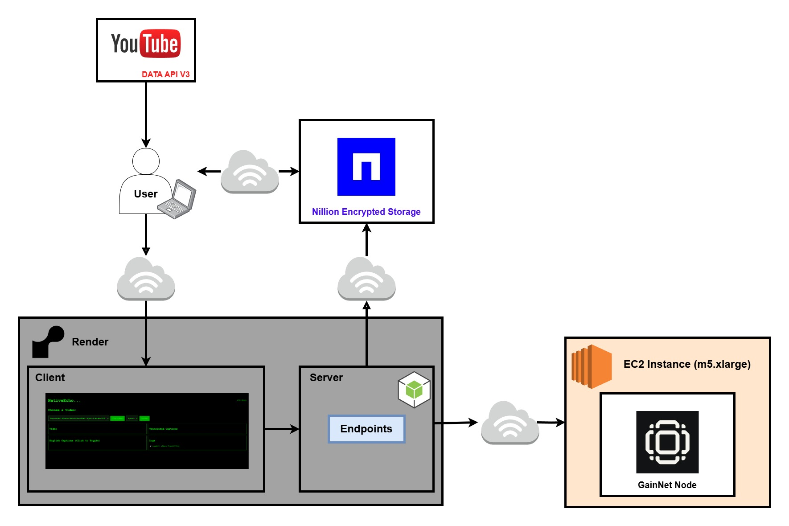

# NativeEcho

NativeEcho is a decentralized translation application that allows users to translate YouTube videos into their native language using AI-powered language models. This project integrates Python for web scraping YouTube closed captions, JavaScript for data uploading, and a decentralized storage layer on Nillion. The AI translation is powered by a language model deployed on a GainaNet node running on AWS EC2.

## Features
- **Decentralized Translation**: Ensures data privacy and security by leveraging Nillion's decentralized network.
- **YouTube Caption Extraction**: Uses Python and the YouTube API to retrieve closed captions.
- **AI-Powered Translation**: Captions are translated using a Large Language Model (LLM) deployed on GainaNet.
- **Decentralized Data Storage**: YouTube metadata is stored on Nillion and retrieved for the UI.
- **User-Friendly Interface**: A web-based UI fetches and displays the translated captions.

## Architecture Overview
1. **Scrape YouTube Captions**: Python script retrieves captions from YouTube videos.
2. **Upload Metadata to Nillion**: JSON metadata is uploaded using `upload_data.js`.
3. **Retrieve Data from Nillion**: UI fetches metadata from Nillion.
4. **Translate Captions**: Captions are passed to an LLM deployed on a GainaNet node.
5. **Display Translations**: Translated captions are displayed in the UI.

## Functional Architecture Diagram
Below is the functional architecture diagram illustrating how NativeEcho functions
This is not a network diagram, this diagram's purpose is to help your understanding:



## Partner Technologies
### Nillion
Nillion serves as the decentralized storage layer for NativeEcho. It is used to store metadata extracted from YouTube videos, ensuring that the data remains tamper-proof and secure. Here’s how it works:
- When a YouTube video’s captions are scraped, the metadata (including video title, description, and timestamps) is structured as JSON.
- This JSON metadata is uploaded to Nillion using `upload_data.js`.
- The frontend fetches metadata from Nillion, ensuring the data remains decentralized and resistant to single points of failure.

### GainaNet
GainaNet powers the AI translation by hosting the LLM on a decentralized node. The key aspects of its implementation in NativeEcho include:
- The LLM (`Qwen2.5-0.5B-Instruct-Q5_K_M`) deployed on a GainaNet node (AWS EC2 `m5.xlarge`) receives the extracted captions.
- Each caption segment is sent to the model via API requests.
- The translated text is returned and displayed in the UI, enabling users to understand the content in their native language.
- Additionally, `Nomic-embed-text-v1.5` is used for text embedding, improving the retrieval of contextual information.

## Implementing Schema for YouTube API Compatibility
To ensure consistency with YouTube’s API responses, we implemented `schema.json` to match the structure of YouTube’s metadata. This allows seamless integration and accurate data storage in Nillion.

### **Schema Implementation**
- The **`schema.json`** file defines the format in which video metadata and captions are stored.
- It includes fields like:
  ```json
  {
    "video_id": "string",
    "title": "string",
    "description": "string",
    "publishedAt": "string",
    "captions": [
      {
        "start_time": "float",
        "end_time": "float",
        "text": "string"
      }
    ]
  }
  ```
- This ensures that the extracted data follows the expected API response format, making it easier to interact with YouTube’s API and Nillion’s decentralized storage.

## Technologies Used
- **Backend**: Python (YouTube API, web scraping)
- **Frontend**: HTML, JavaScript, CSS
- **Decentralized Storage**: Nillion
- **AI Translation**: GainaNet Node running on AWS EC2 (m5.xlarge)
  - **Model Name for Chat**: `Qwen2.5-0.5B-Instruct-Q5_K_M`
  - **Model Name for Text Embedding**: `Nomic-embed-text-v1.5`
- **Deployment**: Render (https://nativeecho.onrender.com)

## Prerequisites
Before running the project locally, ensure you have the following installed:
- **Python 3.8+**
- **Node.js 16+**
- **NPM or Yarn**
- **FFmpeg** (for YouTube captions processing)

### Installing Dependencies
Run the following commands to install required dependencies:

#### Python Dependencies
```sh
pip install -r requirements.txt
```

#### Node.js Dependencies
```sh
npm install
```

## Setting Up Environment Variables
Create a `.env` file in the root directory and populate it with the required API keys and configuration values:

```
YOUTUBE_API_KEY=<your-youtube-api-key>
GAIA_AUTH="Bearer <your-gaianet-auth-token>"  # Ensure 'Bearer ' is included before the token
GAIA_DOMAIN=<your-gaianet-domain>
NillionDID=<your-nillion-did>
NillionPublicKey=<your-nillion-public-key>
NillionPrivateKey=<your-nillion-private-key>
NILLION_SCHEMA_ID=<your-nillion-schema-id>
```

Example GAIA_AUTH:
```
GAIA_AUTH="Bearer sidjad7cGisNJhooA87922e32e3..."
```

## Helpful Resources
- **YouTube API Key Generation**: [Watch Here](https://www.youtube.com/watch?v=EPeDTRNKAVo)
- **GaiaNet ETHGlobal Workshop**: [Watch Here](https://www.youtube.com/watch?v=J6ftu52nwSs)
- **GaiaNet Documentation**: [Read Here](https://docs.gaianet.ai/intro)
- **Nillion ETHGlobal Workshop**: [Watch Here](https://www.youtube.com/watch?v=XOhSgnTm_Zo)
- **Nillion Documentation**: [Read Here](https://docs.nillion.com/build/secret-vault-quickstart)

## Running the Application Locally

### 1. Extract YouTube Captions
Run the following Python script to scrape closed captions from a YouTube video:
```sh
python youtube_retrieval.ipynb --video_id <YouTube Video ID>
```
This generates a JSON file containing the video metadata and captions.

### 2. Upload Metadata to Nillion
Use the Node.js script to upload the extracted JSON file to Nillion:
```sh
node upload_data.js <path-to-json>
```

### 3. Run the Frontend UI Locally
Start the frontend interface to interact with the translated captions:
```sh
npm start
```
The UI will fetch metadata from Nillion and display it.

### 4. Translate Captions via LLM
Captions are sent to the AI model running on GainaNet, and translations are retrieved dynamically.

## Troubleshooting
### Common Issues & Solutions
#### 1. Python Dependencies Not Installing
Ensure you are using the correct Python version (3.8+):
```sh
python --version
```
Try using a virtual environment:
```sh
python -m venv venv
source venv/bin/activate  # Mac/Linux
venv\Scripts\activate    # Windows
pip install -r requirements.txt
```

#### 2. Node.js Issues
If you encounter errors when running Node.js scripts, ensure you are using the correct version:
```sh
node -v
```
Try deleting and reinstalling `node_modules`:
```sh
rm -rf node_modules package-lock.json
npm install
```

#### 3. `.env` File Not Being Read
Check that your `.env` file exists and is properly formatted. If necessary, install `dotenv` for Node.js:
```sh
npm install dotenv
```

## Future Improvements
- Implement user authentication for personalized translations.
- Support additional video platforms beyond YouTube.
- Enhance UI performance and interactivity.

## License
This project is licensed under the MIT License. See [LICENSE](LICENSE) for more details.

## Next Steps
1. **Enhancing Caption Retrieval**: Finding a better way to retrieve auto-generated captions from YouTube, possibly by implementing our own audio-to-text extraction alongside YouTube's captions.
2. **Upgrading LLM and Context Awareness**: Improving the LLM model and prompt engineering to better capture the full context of the workshop, preventing misinterpretations in auto-generated captions. Additionally, enabling document-based web searches as extra context.
3. **Implementing a Token-Gated Experience**: Introducing a pricing schema where API calls are token-gated, charging per request type.
4. **Multi-Agent Translation Validation**: Levarging multiple AI agents/ models to check translation accuracy,
perhaps enhancing results with web search